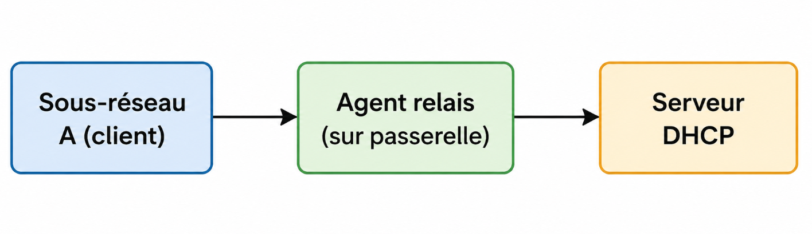
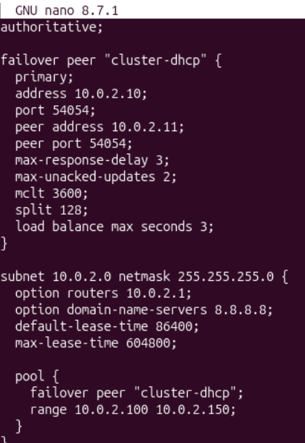
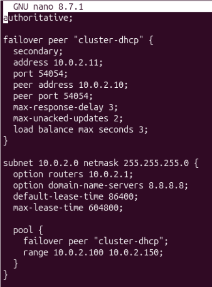
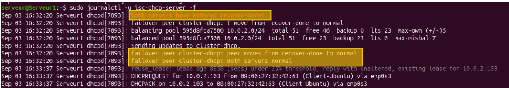

# Partie C — Agent relais DHCP & Grappe DHCP (Failover)


[⬅ Retour au sommaire du projet](../README.md)

## Objectif

À la suite de la partie B, qui a mis en évidence les risques d'une redondance DHCP non synchronisée, cette partie présente deux mécanismes utilisés en environnement professionnel :

- **l'agent relais DHCP**, indispensable dès lors que le réseau est segmenté en plusieurs sous-réseaux ;
- **la grappe DHCP en failover**, qui permet de synchroniser deux serveurs DHCP afin de garantir la continuité de service sans risque de conflit d'adresses.

---

## Sommaire

1. [Agent relais DHCP — théorie](#1-agent-relais-dhcp--théorie)
2. [Grappe DHCP (Cluster Failover) — objectif](#2-grappe-dhcp-cluster-failover--objectif)
3. [Synchronisation temporelle des serveurs (NTP)](#3-synchronisation-temporelle-des-serveurs-ntp)
4. [Configuration du failover — serveur primaire](#4-configuration-du-failover--serveur-primaire)
5. [Configuration du failover — serveur secondaire](#5-configuration-du-failover--serveur-secondaire)
6. [Redémarrage et vérification de la liaison failover](#6-redémarrage-et-vérification-de-la-liaison-failover)
7. [Tests de bascule (failover)](#7-tests-de-bascule-failover)

---

## 1. Agent relais DHCP — théorie

Les trames ARP et BOOTP (sur lesquelles repose le protocole DHCP) ne traversent pas les routeurs. Sur un réseau segmenté en plusieurs sous-réseaux, il est donc impossible d'utiliser un serveur DHCP unique pour l'ensemble des segments : soit un serveur DHCP est déployé sur chaque sous-réseau, soit un **agent relais DHCP** est utilisé.

> [!NOTE]
> Un agent relais DHCP est un service chargé de transmettre les requêtes DHCP d'un client, reçues sur un sous-réseau donné, vers un serveur DHCP situé sur un autre sous-réseau et inversement pour la réponse. Il doit connaître l'adresse IP du serveur DHCP cible et posséder lui-même une adresse IP fixe.

L'agent relais est généralement installé sur la **passerelle** du sous-réseau concerné, à l'aide du paquet `dhcp-relay`.



> [!TIP]
> Cette solution permet de centraliser l'administration DHCP sur un serveur unique (ou une grappe de serveurs, cf. section suivante), même lorsque le réseau comporte plusieurs sous-réseaux physiquement ou logiquement séparés.

---

## 2. Grappe DHCP (Cluster Failover) — objectif

Contrairement à la configuration testée en partie B, l'objectif ici est de garantir qu'un serveur DHCP soit **toujours disponible**, tout en s'assurant que les deux serveurs distribuent la même plage d'adresses **de manière synchronisée**, sans risque de conflit.

Cette solution repose sur le protocole **DHCP Failover**, natif à `isc-dhcp-server`, qui permet à deux serveurs de répliquer en temps réel l'état de leurs baux.

On réutilise les deux serveurs Ubuntu configurés en partie B (`10.0.2.10` et `10.0.2.11`).

---

## 3. Synchronisation temporelle des serveurs (NTP)

> [!IMPORTANT]
> Le protocole de failover DHCP échange en permanence des horodatages entre les deux serveurs afin de déterminer lequel a le droit d'attribuer quoi, et depuis quand. Si les horloges des deux serveurs dérivent trop l'une par rapport à l'autre, ils peuvent se considérer mutuellement « en panne » à tort, et le cluster bascule alors dans un état d'erreur (`communications-interrupted`). **La synchronisation NTP des deux serveurs est donc indispensable.**

Sur chaque serveur : **Configuration → Horloge → NTP** (cocher NTP, choisir un serveur français).

```bash
sudo apt install ntpsec-ntpdate
ntpdate
ntpdate -b   # force la synchronisation
```

---

## 4. Configuration du failover — serveur primaire

Sur le serveur 1 (`10.0.2.10`), on modifie `/etc/dhcp/dhcpd.conf` :

```conf
authoritative;

failover peer "cluster-dhcp" {
  primary;
  address 10.0.2.10;
  port 54054;
  peer address 10.0.2.11;
  peer port 54054;
  max-response-delay 3;
  max-unacked-updates 2;
  mclt 3600;
  split 128;
  load balance max seconds 3;
}

subnet 10.0.2.0 netmask 255.255.255.0 {
  option routers 10.0.2.1;
  option domain-name-servers 8.8.8.8;
  default-lease-time 86400;
  max-lease-time 604800;

  pool {
    failover peer "cluster-dhcp";
    range 10.0.2.100 10.0.2.150;
  }
}
```



| Directive | Rôle |
|---|---|
| `primary` / `secondary` | Définit le rôle de chaque serveur dans la paire de failover |
| `mclt` (Maximum Client Lead Time) | Durée maximale pendant laquelle un serveur peut prolonger un bail sans confirmation de son pair |
| `split 128` | Répartit la charge de manière équitable (50/50) entre les deux serveurs |
| `max-response-delay` | Délai avant qu'un serveur ne considère son pair comme injoignable |
| `load balance max seconds` | Bascule automatique de l'équilibrage de charge en cas de forte latence entre les deux serveurs |

---

## 5. Configuration du failover — serveur secondaire

Sur le serveur 2 (`10.0.2.11`) :

```conf
authoritative;

failover peer "cluster-dhcp" {
  secondary;
  address 10.0.2.11;
  port 54054;
  peer address 10.0.2.10;
  peer port 54054;
  max-response-delay 3;
  max-unacked-updates 2;
  load balance max seconds 3;
}

subnet 10.0.2.0 netmask 255.255.255.0 {
  option routers 10.0.2.1;
  option domain-name-servers 8.8.8.8;
  default-lease-time 86400;
  max-lease-time 604800;

  pool {
    failover peer "cluster-dhcp";
    range 10.0.2.100 10.0.2.150;
  }
}
```



> [!NOTE]
> La directive `mclt` n'est renseignée que du côté du serveur **primaire** ; elle est héritée automatiquement par le secondaire lors de l'établissement de la liaison.

---

## 6. Redémarrage et vérification de la liaison failover

```bash
sudo systemctl restart isc-dhcp-server
sudo journalctl -u isc-dhcp-server -f
```



La ligne de log `Both servers normal` confirme que le protocole de failover est actif et que la synchronisation entre les deux serveurs DHCP est effective.

---

## 7. Tests de bascule (failover)

### 7.1 Attribution normale d'une adresse

On connecte un client et on le laisse obtenir une adresse IP :

```powershell
ipconfig
```

> `images/04-client-ipconfig.png`

Le client obtient l'adresse `10.0.2.104`.

### 7.2 Vérification de la réplication des baux

```bash
sudo cat /var/lib/dhcp/dhcpd.leases
```

> `images/05-leases-repliques.png`

Le bail correspondant à l'adresse `10.0.2.104` apparaît **sur les deux serveurs** : c'est la réplication du cluster failover qui assure cette synchronisation, contrairement à la configuration « à plat » testée en partie B.

### 7.3 Simulation de la panne du serveur primaire

```bash
sudo shutdown now
```

### 7.4 Renouvellement du bail côté client

```bash
# Linux
sudo dhclient -r
sudo dhclient
```

```powershell
:: Windows
ipconfig /release
ipconfig /renew
```

### 7.5 Validation de la bascule

Le client doit obtenir une adresse IP malgré l'extinction du serveur primaire : c'est le serveur **secondaire** qui prend le relais automatiquement, sans intervention manuelle.

> [!IMPORTANT]
> 🚧 **À venir** — La capture de validation finale (extinction du serveur primaire et confirmation de l'attribution d'IP par le serveur secondaire) reste à réaliser et à documenter dans une prochaine mise à jour de cette procédure.

---

## Conclusion

La mise en place d'une grappe DHCP en failover répond directement aux limites identifiées en partie B : les deux serveurs partagent désormais un état commun de leurs baux, garantissant qu'une même adresse IP ne peut pas être distribuée à deux clients différents, tout en assurant la continuité de service en cas de panne de l'un des deux serveurs. Associée à un agent relais sur les réseaux segmentés, cette architecture constitue une solution DHCP robuste et adaptée à un environnement de production.

---

[⬅ Partie précédente : Redondance DHCP](../Partie%20B%20—%20Redondance%20DHCP/procedure-redondance-dhcp.md)

[Retour au sommaire du projet](../README.md)
